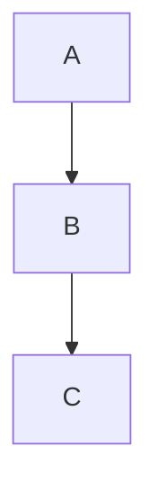

```mermaid
flowchart TB
A --> B
B --> C
```

\

\

!\[Metrics\](/github-metrics.svg)

[https://github.com/Eliminater74/Eliminater74/blob/main/github-metrics.svg](https://github.com/Eliminater74/Eliminater74/blob/main/github-metrics.svg)
