# ⚡ Eliminater74 / Michael H. ⚡

 

**Android Systems Developer • Reverse Engineering • ROM / Kernel Engineering • IPTV Platform Development • VR Systems**

Founder of **PureFusion ROM** & **Nebula Kernel**  
MultiROM Porter for **LG G3 All Variants** • Router Firmware Dev • Chrome Extensions • Android TV Systems • VR Apps

---

## 🚀 Core Engineering Work

### 🔹 PureFusionIPTV *(Private)*

> High-performance Android TV IPTV platform engineered for TiviMate-class speed, precision, and UX.

- ExoPlayer-based playback architecture  
- Fast channel switching / zap-performance focus  
- EPG optimization and high-speed guide rendering  
- Navigation system tuned for strict UX parity + improvements  
- Designed for both low-end and high-end Android TV devices  

---

### 🔹 PureFusion Ecosystem

- **PureFusion ROM** — Custom Android ROM development  
- **Nebula Kernel** — Performance-focused kernel engineering  
- **MultiROM LG G3 Port** — Full MultiROM support across LG G3 variants  
- **Router Firmware Projects** — Automated builds (GitHub Actions heavy use)  
- **PureFusion Feed** — Advanced Chrome extension  
- **PureFusion Torrent Bridge** — Automation + integration tooling  
- **VR / Immersive Projects** — Experimental VR apps  

---

## 🧠 Technical Stack

---

## ⚙️ Specializations

- Android (Kotlin / Java / native)  
- Reverse engineering (APK / JADX / manifests)  
- ROM / kernel engineering  
- IPTV / streaming / EPG systems  
- VR / immersive development  
- CI/CD automation (GitHub Actions)  
- Performance optimization  

---

## 📊 GitHub Metrics

  

  

  

  

  

---

## 🧩 Development Footprint
Android Systems ▰▰▰▰▰▰▰▰▰▰
ROM / Kernel Work ▰▰▰▰▰▰▰▰▰
Reverse Engineering ▰▰▰▰▰▰▰▰
IPTV / Media Systems ▰▰▰▰▰▰▰▰
Automation / CI ▰▰▰▰▰▰▰
Chrome Extensions ▰▰▰▰▰▰
VR / Immersive Apps ▰▰▰▰▰▰
Linux / Firmware ▰▰▰▰▰▰

---

## 🔥 Engineering Philosophy

> Performance. Control. Precision.

- Eliminate unnecessary overhead  
- Optimize for real-world performance  
- Treat UX, latency, stability as core targets  
- Build measurable, scalable systems  
- No compromises  

---

### ⚡ PureFusion Mindset ⚡

**No bloat. No excuses. Build it right.**

