# Eliminater74

### Michael H. | Android Systems Developer

**ROM and kernel engineering | Reverse engineering | IPTV platforms | Automation | VR systems**

I build performance-focused Android and Linux systems, private media tooling, automation pipelines,
and low-level platform work where latency, stability, and control matter.

---

## Core Work

### PureFusionIPTV

Private Android TV IPTV platform engineered for fast playback, responsive guide navigation,
and predictable performance on both low-end and high-end devices.

- ExoPlayer-based playback architecture
- Fast channel switching and zap-performance tuning
- EPG loading, parsing, and rendering optimization
- Android TV navigation and remote-first UX refinement
- Platform behavior tested against real-world device constraints

### PureFusion Ecosystem

- **PureFusion ROM**: custom Android ROM development
- **Nebula Kernel**: performance-focused Android kernel engineering
- **MultiROM LG G3 Port**: MultiROM support across LG G3 variants
- **Router firmware projects**: automated Linux firmware builds
- **PureFusion Feed**: Chrome extension and automation tooling
- **PureFusion Torrent Bridge**: integration and workflow automation
- **VR / immersive projects**: experimental immersive application work

---

## Technical Stack

---

## Specializations

- Android platform engineering with Kotlin, Java, native code, and system-level debugging
- Reverse engineering with APK analysis, JADX, manifests, runtime behavior, and integration mapping
- ROM, kernel, recovery, boot image, and device-tree workflows
- IPTV, streaming playback, EPG systems, and Android TV UX
- CI/CD automation with GitHub Actions and repeatable build pipelines
- Linux firmware, router workflows, Chrome extensions, and immersive application experiments

---

## GitHub Metrics

  

  

  

  

  

  

  

  

  

  

  

  

  

  

  

---

## Development Footprint

| Area | Focus |
| --- | --- |
| Android systems | ROMs, platform behavior, device integration |
| Kernel work | Performance tuning, boot flows, low-level debugging |
| Reverse engineering | APK analysis, manifests, app behavior, integrations |
| IPTV and media | Playback, EPG, Android TV navigation, latency |
| Automation | GitHub Actions, repeatable builds, release workflows |
| Linux and firmware | Router firmware, shell workflows, system tooling |
| VR and immersive | Experimental apps and interaction models |

---

## Engineering Principles

- Measure before optimizing
- Keep systems fast, observable, and maintainable
- Prefer direct control over unnecessary abstraction
- Treat UX latency and runtime stability as engineering requirements
- Build tooling that can be repeated, audited, and improved

**Performance first. Clean systems. Build it right.**

